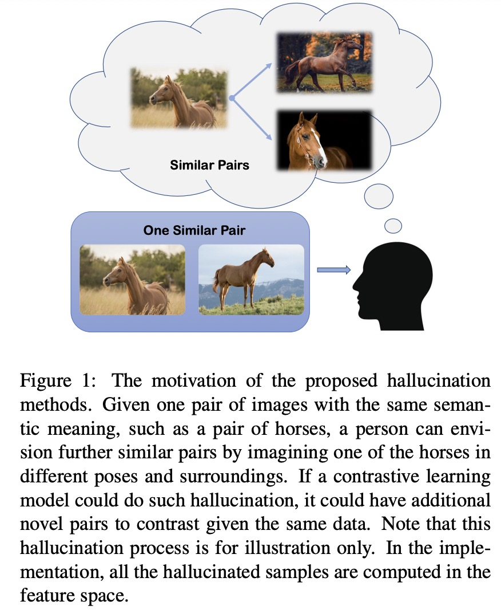

## Hallucination Improves the Performance of Unsupervised Visual Representation Learning (ICCV2023)




This repo includes PyTorch implementation of **SimCLR**, **MoCoV1**, **MoCoV2** and **SimSiam**, as well as their DDP training code.


## Overview
 1. [Dependencies](#Dependencies)
 2. [Datasets](#Datasets)
 3. [Pre-training](#Pre-training)
 4. [Linear_Evaluation](#Linear_Evaluation)


## Dependencies  <a name="Dependencies"></a>
1. Create a python enviroment with `pytorch >= 1.8.1`.
2. `pip install -r requirements.txt`


## Datasets  <a name="Datasets"></a>
Please download and organize the datasets in this structure:
```
ContrastiveCrop
├── data/
    ├── ImageNet/
    │   ├── train/ 
    │   ├── val/
    ├── cifar-10-batches-py/
    ├── cifar-100-python/
    ├── stl10_binary/
    ├── tiny-imagenet-200/
    │   ├── train/
    │   ├── val/
```
Use the following [script](https://gist.github.com/moskomule/2e6a9a463f50447beca4e64ab4699ac4) to prepare tiny-imagenet-200.

## Pre-training  <a name="Pre-training"></a>
A few pre-training examples.
```
# MoCo-V1&V2: CIFAR-10 + Hallucination
python DDP_moco.py configs/small/cifar10/moco_center_hallucinate.py

# MoCo-V1&V2, CIFAR-100 + Hallucination
python DDP_moco.py configs/small/cifar100/moco_center_hallucinate.py

# MoCo-V1&V2: IN-200 + Hallucination
python DDP_moco.py configs/small/IN200/moco_center_hallucinate.py

# MoCo-V1&V2: IN-1K + Hallucination
python DDP_moco.py configs/small/IN1K/moco_center_hallucinate.py
```


## Linear_Evaluation  <a name="Linear_Evaluation"></a>
```
# CIFAR-10
python DDP_linear.py configs/linear/cifar10_res18.py --load ./checkpoints/small/cifar10/moco_center_hallucinate/last.pth

# CIFAR-100
python DDP_linear.py configs/linear/cifar100_res18.py --load ./checkpoints/small/cifar100/moco_center_hallucinate/last.pth

# IN-200 
python DDP_linear.py configs/linear/IN200_res50.py --load ./checkpoints/IN200/moco_center_hallucinate/last.pth

# IN-1K
python DDP_linear.py configs/linear/IN1K_res50.py --load ./checkpoints/IN1K/moco_center_hallucinate/last.pth
```

